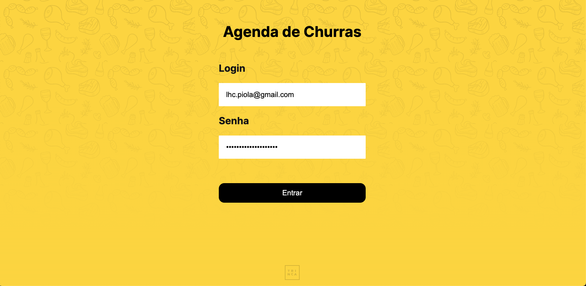
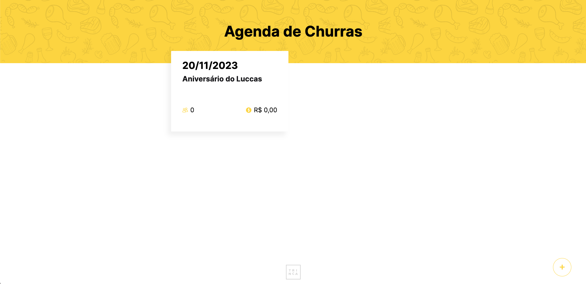
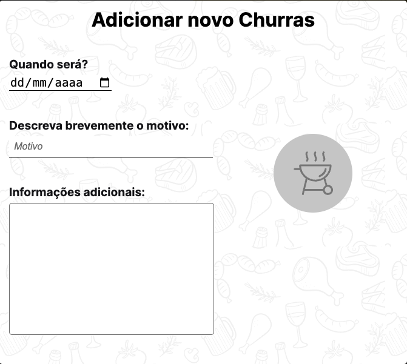
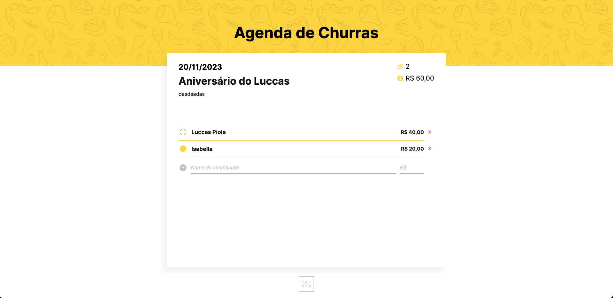

<h1 align="center">
  
</h1>

<h3 align="center">
  Teste para a Trinca utilizando React + Next + Typescript
</h3>

Repostório dedicado para realizar o teste proposto pela Trinca, utilizando Next.

<blockquote align="center">“Programs must be written for people to read, and only incidentally for machines to execute.” ― Harold Abelson</blockquote>

  <a href="#sobre-o-teste">Sobre o teste</a>&nbsp;&nbsp;&nbsp;|&nbsp;&nbsp;&nbsp;
  <a href="#funcionamento">Funcionamento</a>&nbsp;&nbsp;&nbsp;|&nbsp;&nbsp;&nbsp;
  <a href="#ver-funcionando">Ver funcionando</a>

## Sobre o teste

Esse é o teste proposto pela [Trinca](https://trin.ca/), com o intuito de analisar
e contratar um Engenheiro de Software Front-end.

O teste consistia no desenvolvimento de uma aplicação onde fosse possível cadastrar
churrascos propostos pela empresa, com data, nome e observações adicionais.

### **Tecnologias utilizadas para o teste**

- :green_heart: &nbsp;**[NextJS](https://nextjs.org/)** — Framework React para renderização
  de componentes no lado do servidor.
- :purple_heart: &nbsp;**[styled-components](https://styled-components.com/)** — Biblioteca para estilização de componentes React.
- :yellow_heart: &nbsp; Prettier, ESlint - Tecnologias para padronização de código;
- :blue_heart: &nbsp; [TypeScript](https://www.typescriptlang.org/) - Tecnologia para tipagem e melhoria de arquitetura JavaScript.
- :heart: &nbsp; [json-server](https://github.com/typicode/json-server) - Tecnologia para a criação de uma API REST fake.

## Funcionamento

Em primeira instância, possuímos uma tela de login, mas não há uma integração
com nenhuma forma de autenticação. Apenas um e-mail válido e uma senha com 6
dígitos é suficiente para logar.

<h1 align="center">
  
</h1>

Após o login, somos apresentados com uma tela que faz a listagem dos churrascos
cadastrados, tão quanto possibilita a criação de novos.

<h1 align="center">
  
</h1>

<h1 align="center">
  
</h1>

Além disso, podemos entrar na página específica do churrasco para ver mais detalhes
e adicionar contribuições, digitando o nome da pessoa e o valor.

Em relação a contribuições, é possivel adicionar, remover e declarar uma contribuição
como paga.

<h1 align="center">
  
</h1>

## Ver funcionando

Para análise de código, este repositório foi criado utilizando a arquitetura de componentização. Sobre a arquitetura de pastas:

- _components_ - Componentes reutilizáveis da aplicação.
- _lib_ - Funções assíncronas para chamada dos Route Handlers do NextJS.
- _types_ - Tipagens globais da aplicação.
- _utils_ - Funções reutilizáveis.
- _app_ - Páginas e componentes relacionadas ao NextJS.
- _db.json_ - Banco de dados fake utilizado pelo json-server.

Para análise e ver funcionando diretamente na máquina local:

1. Clone este repositório utilizando o comando <code>git clone https://github.com/LuccasPiola/churras-trinca.git</code>
2. Entre na pasta clonada utilizando <code>cd churras-trinca</code>
3. Rode o comando <code>npm i</code> no terminal, para a instalação das dependências  
   &nbsp; &nbsp; 3.1 Versão utilizada do Node: **18.17.1**  
4. Rode o comando <code>npm run trinca</code> no terminal. Isso fará um build da aplicação e disponibilizará uma versão otimizada em <code>http://localhost:3000</code>, além de rodar
   a API na porta 3004.

---

This test was made by Trinca. Repository by Luccas Piola. ♥ &nbsp;for JavaScript.
